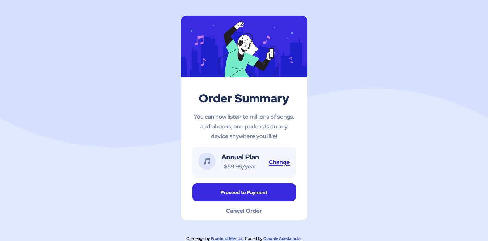

# Frontend Mentor - Order summary card solution

This is a solution to the [Order summary card challenge on Frontend Mentor](https://www.frontendmentor.io/challenges/order-summary-component-QlPmajDUj). Frontend Mentor challenges help you improve your coding skills by building realistic projects.

## Table of contents

- [Overview](#overview)
  - [The challenge](#the-challenge)
  - [Screenshot](#screenshot)
  - [Links](#links)
- [My process](#my-process)
  - [Built with](#built-with)
- [Author](#author)

## Overview

### The challenge

Users should be able to:

- See hover states for interactive elements

### Screenshot

### Links

- Solution URL: [https://github.com/Dprof-code/order-summary-component]
- Live Site URL: [https://peaceful-twilight-7576db.netlify.app/]

## My process

### Built with

- Semantic HTML5 markup
- CSS custom properties
- Flexbox
- Mobile-first workflow

## Author

- LinkedIn - [Olawale Adedamola](https://www.linkedin.com/in/olawale-adedamola-b9b1641a2/)
- Frontend Mentor - [@dprof-code](https://www.frontendmentor.io/profile/dprof-code)
- Twitter - [@pr0devs](https://www.twitter.com/pr0devs)
